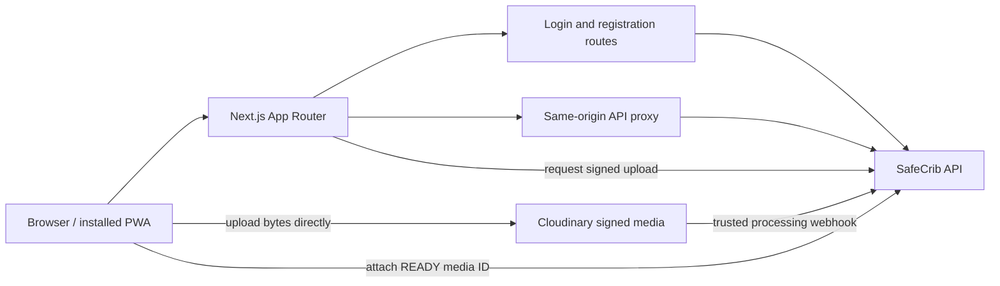
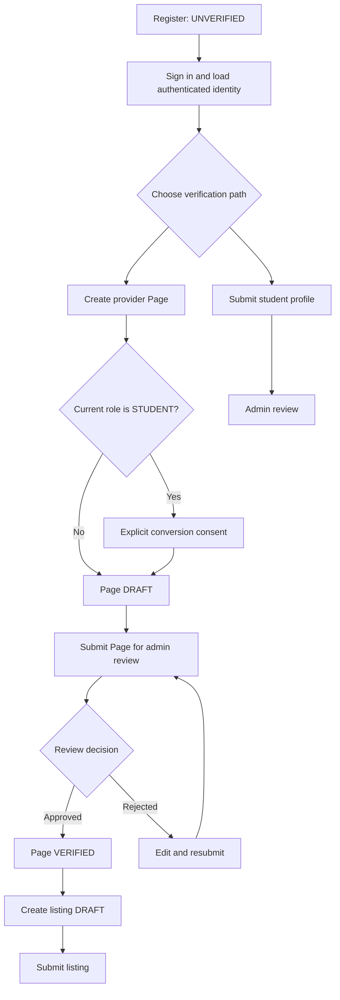
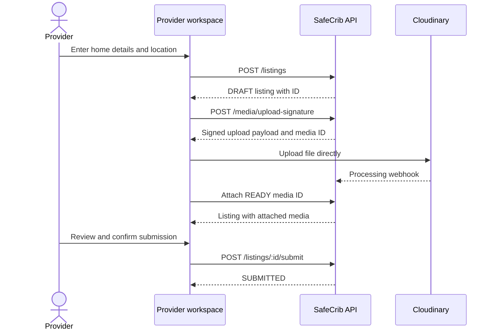

<p align="center">


</p>

<p align="center"><strong>Student accommodation, built around trust.</strong></p>

SafeCrib is a mobile-friendly accommodation marketplace frontend for students, agents, landlords, and operations staff. It connects verified profiles and provider pages with reviewed home listings, booking actions, support conversations, and trust-stage badges.

> **Repository scope:** this directory contains the Next.js frontend and Cloudflare deployment configuration. The backend project lives at `../safecrib-backend/`. The frontend treats persisted backend identity, authorization, verification, listing state, and trust state as authoritative.

## Contents

- [Product model](#product-model)
- [Architecture](#architecture)
- [Key workflows](#key-workflows)
- [Routes](#routes)
- [Project layout](#project-layout)
- [Run locally](#run-locally)
- [API and media integration](#api-and-media-integration)
- [Security and privacy](#security-and-privacy)
- [Appearance and accessibility](#appearance-and-accessibility)
- [Checks](#checks)
- [Cloudflare deployment](#cloudflare-deployment)
- [Known API contract gaps](#known-api-contract-gaps)
- [Further documentation](#further-documentation)

## Product model

An account has one active mode. A new registration does not grant student, provider, or administrator permissions. Review state and server authorization decide which workflows are available.

| Mode | Typical experience | Access boundary |
|---|---|---|
| `UNVERIFIED` | Account setup, browse homes, provider application, support | No verified student/provider privileges |
| `STUDENT` | Browse, save, contact, and book homes | Requires an approved student profile for student-only actions |
| `AGENT` | Provider workspace, listings, and booking | Listing management requires the owned provider Page to be `VERIFIED` |
| `LANDLORD` | Provider workspace, listings, and booking | Listing management requires the owned provider Page to be `VERIFIED` |
| `ADMIN` | Review queue and support operations | Requires both the `ADMIN` role and backend admin membership |

Provider verification is an explicit account-mode transition. A student must consent before the UI sends `switchAccountToProvider: true`; pending approval does not grant provider permissions. Admin access is kept separate from customer navigation.

## Architecture



The catch-all proxy in `src/app/api/backend/[...path]/route.ts` forwards same-origin `/api/backend/api/v1/...` requests to the configured API origin. Login, registration, and Socket.IO use the same origin selection. In development the default is `http://localhost:3001`; in production it is `https://safecrib.onrender.com`. Set `NEXT_PUBLIC_API_URL` to override either value.

### Account and review flow



### Listing and media flow



## Key workflows

- **Marketplace:** only verified public listings should appear in search. Students can inspect maps/media, bookmark, contact providers, book, and submit fraud reports according to backend authorization.
- **Student onboarding:** signup creates an unverified account; profile submission and approval control student-only actions.
- **Provider workspace:** provider Page review precedes listing creation. Listings support drafts, review submission, five photos, one optional video, location coordinates, address/reference, and discount pricing.
- **Trust recognition:** the `/profile` page displays the backend-provided verification stage, badge, risk state, criteria, and milestone. The browser does not calculate trust tiers.
- **Account settings:** customers use `/profile`; administrators use `/admin/settings`. Display name and password controls are shared, while role/membership remain server-managed.
- **Support:** signed-in users can open and follow support conversations. Admin replies and resolution use separate admin routes.
- **Themes:** settings offer Device, Light, Dim (navy), and Dark (black); the preference applies across the app and is stored in browser local storage.
- **PWA:** the app includes an install prompt, manifest, service worker, network status UI, and an offline shell. User/API data is not cached by the service worker.

## Routes

| Route | Purpose |
|---|---|
| `/` | Public SafeCrib product page |
| `/signup`, `/login` | Customer account registration and sign-in |
| `/dashboard` | Browse verified homes and account-aware actions |
| `/dashboard/listings/:id` | Listing details, map/media, booking, and reporting |
| `/profile` | Customer settings and verification overview |
| `/profile/complete` | Student verification submission/update |
| `/support`, `/support/:id` | Customer support inbox and conversation |
| `/page` | Agent/landlord provider workspace |
| `/page/new` | Provider Page verification |
| `/page/homes/new` | Create, edit, upload, review, and submit a home |
| `/admin/login`, `/admin` | Admin sign-in and review queue |
| `/admin/support` | Admin support inbox and conversation tools |
| `/admin/settings` | Administrator account settings |

## Project layout

```text
src/
	app/              Next.js routes, layouts, API handlers, and global styles
	components/       Branding, dashboard, settings, theme, verification, and UI
	hooks/            Client-side PWA install state
	lib/              API/cache helpers, drafts, support and PWA utilities
docs/               Backend handoffs and direct-testing guides
public/             PWA service worker and install icons
```

The UI uses the App Router, React 19, TypeScript, Tailwind CSS, and small local components. Reuse the existing API helpers and UI components when adding routes; avoid duplicating auth, cache, upload, and theme logic.

## Run locally

### Requirements

- Node.js 20 LTS recommended
- npm
- A local backend and Redis for local authenticated and real-time notification flows

### Install and start

```sh
npm ci
cp .env.example .env.local
npm run dev
```

Start the backend and Redis using the instructions in `../safecrib-backend/README.md`, then open `http://localhost:3000`. Set `NEXT_PUBLIC_API_URL` in `.env.local` if the backend runs on a different origin.

### Useful commands

| Command | Purpose |
|---|---|
| `npm run dev` | Start Next.js development server |
| `npm run build` | Build the standard Next.js production output |
| `npm run start` | Serve a standard Next.js build |
| `npm run lint` | Run ESLint across the repository |
| `npx tsc --noEmit` | Run TypeScript checking |
| `npm run preview` | Build and preview the Cloudflare/OpenNext worker |
| `npm run deploy` | Build and deploy with Wrangler |

There is currently no automated test script configured in `package.json`. Before submitting changes, run lint and type-checking plus focused route/API checks for the changed workflow.

## API and media integration

- **Live API docs:** [safecrib.onrender.com/api/v1/docs](https://safecrib.onrender.com/api/v1/docs#/)
- **API origin:** `NEXT_PUBLIC_API_URL` (or `NEXT_PUBLIC_API_ORIGIN` / `NEXT_PUBLIC_BACKEND_URL`) configures the API proxy, login/registration, and notification Socket.IO client. Local development defaults to `http://localhost:3001`; production defaults to `https://safecrib.onrender.com`.
- **Authentication:** access tokens are sent as `Authorization: Bearer <token>`. The client refreshes sessions and keeps current-user data in a best-effort browser cache for fast page transitions.
- **Errors:** handle `401` as an expired/missing session, `403` as an authorization decision, `404` as a missing resource, and `409` as a state/limit conflict. Do not silently override server decisions in client state.
- **Uploads:** request a signed upload, upload bytes to Cloudinary, wait for `READY`, then attach the media ID to the listing. Video readiness is webhook-driven.
- **Trust:** fetch `/trust/me/verification-stage` and `/trust/me`; use the returned stage and risk state. Do not compute badges from a score or role in the browser.

## Security and privacy

- Backend authorization is authoritative. Hiding a UI action is not a substitute for handling API `401`/`403` responses.
- Never accept browser-supplied roles, listing ownership, review state, generated registration references, trust scores, or fraud decisions as authorization facts.
- Do not expose admin review, trust breakdown, or fraud-resolution controls in customer/provider pages.
- Keep license documents private. Use signed media references and authenticated delivery; do not place private proof URLs in public listing data.
- Do not treat a pending upload as listing media until the listing response confirms attachment.
- Drafts and theme preferences are stored locally for usability. They do not grant server permissions.
- Never commit access tokens, refresh tokens, passwords, payout details, or private media URLs.

## Appearance and accessibility

Theme modes are `Device`, `Light`, `Dim`, and `Dark`. Device follows `prefers-color-scheme`; explicit selections are saved in local storage. Dim uses deep navy surfaces, while Dark uses black surfaces. Shared theme tokens cover foreground, muted, links, semantic statuses, fields, and overlays.

Icon-only controls must retain accessible names and tooltips. Focus states, reduced-motion preferences, responsive layouts, screen-reader labels for illustrations, and high-contrast status colors are part of the UI contract.

## Cloudflare deployment

The project uses OpenNext for Cloudflare Workers (`open-next.config.ts`) and Wrangler (`wrangler.jsonc`). The worker entry is `.open-next/worker.js`; static assets are emitted to `.open-next/assets`.

1. Authenticate Wrangler for the intended Cloudflare account (`npx wrangler login`) and confirm the target account/project.
2. Check the API origin and any required platform bindings/secrets for the deployment environment.
3. Build a local Cloudflare preview with `npm run preview`.
4. Validate login, protected routes, direct media upload, and refresh behavior against the target API.
5. Deploy with `npm run deploy` only from the intended branch/environment.

Do not assume a successful static build verifies authenticated API, Cloudinary, webhook, or review workflows; those require backend-connected test accounts.

## Known API contract gaps

Confirm these with the backend team before treating the corresponding flows as end-to-end production-ready:

- The provider workflow requires `payoutAccounts` as an array of 1–10 entries, while the live OpenAPI currently describes one `PayoutAccount` object; it also does not mark `providerType` required.
- The deployed API has returned role-guard `403` responses for `UNVERIFIED` on student/status or support routes. The frontend skips restricted status reads and reports denied support submissions honestly; backend role policy must be updated if unverified accounts should use those operations.
- The trust endpoints exist in OpenAPI, but stage response schemas are not documented. The frontend follows the agreed stage payload contract and does not infer badges when fields are missing.
- The current listing backend has no payment processor. `SECURED`/booking state must not be represented as proof that money was collected.
- Duplicate-detection documentation notes worker comparison states that may not match the public `VERIFIED` listing state. Treat duplicate flags as review signals, not automated fraud decisions.

## Further documentation

- [Provider Page backend handoff](docs/backend-provider-page-implementation.md)
- [Provider workflow direct testing](docs/provider-workflow-testing.md)
- [Verification badges and account settings](docs/verification-badge-frontend.md)
- [Live SafeCrib API reference](https://safecrib.onrender.com/api/v1/docs#/)

## Contribution checklist

- Keep authorization and workflow state derived from API responses.
- Preserve responsive, keyboard-accessible, theme-aware UI patterns.
- Add or update direct test documentation when API workflows change.
- Run `npm run lint` and `npx tsc --noEmit` before merging.
- Report external API gaps separately; do not mask a backend denial as frontend success.
